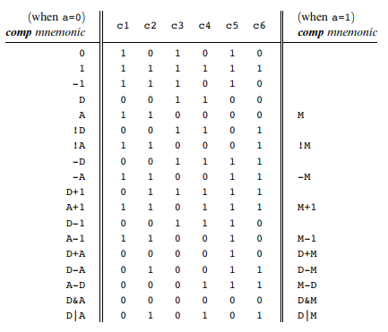
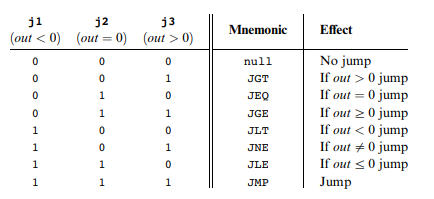

In this blog post we'll talk about what assemblers are and how to build one. Specifically, we'll talk about how to build an assembler for hack assembly.

Demos:

- [assembler built in Java](https://github.com/maxdemaio/hack-computer/tree/main/assembler)

---

## Assembly Languages and Assemblers

Previously I've shown Assembly language and explained that it's compiled to machine language. But, what actually converts assembly into machine code? We'll take a look at an Assembler and how to make one.

assembly -> assembler -> machine language

This is software. This is the first software layer above the hardware layer for our hack computer. This is the first level of software in most computers.

How does the assembler program run? We're going to take it from the perspective that computers already exist to avoid bootstrapping. This is cross compiling. We're writing code to run on one computer intended for another. Using knowledge of a high-level language we can program an assembler for our hack assembly code.

The basic logic of an assembler is the following:

- Read the next assembly language command (ignore whitespace/comments)
- Break it into the fields its made of
- Load r1,18 -> (load,r1,r18)
- Lookup the binary code for that field (hashtable)
- load (command) -> 11001 (opcode)
- r1 -> 01
- 18 -> 000010010
- Combine these codes into a single machine command
- 1100101000010010
- Output machine language command
- Repeat until end of file reached

Symbols make things difficult. Symbols represent labels and variables. The assembler must replace these symbols with addresses. This is done with a symbol table.

If we see a variable is not in the symbol table we have to allocate memory for it (next available register).

If we see a label, we have to remember what address the command was at and allocate memory for it. Forward references are tricky. There are two ways to deal with forward references:

1. Remember you've seen a label that you don't know where it is yet in a side table and add it back to main table
2. Do everything in 2 passes. Only pay attention to labels/symbols in first pass. 2nd pass the labels are converted into the correct addresses.

## Assembly Process - Handling Instructions

Challenges:

- Handling white space (just ignore it)
- Handling instructions (a & c instructions)
- Handling symbols

For a-instructions, we'd see the symbolic syntax of `@value` where `value` is a non-negative decimal constant or a symbol referring to such a constant.

Symbolic example:

```asm
@21
```

Binary example:

```
0valueInBinary // starts with 0 bc it's an a-instruction
```

```
00000000000010101
```

If the value is a decimal constant, we would generate the equivalent 15-bit binary constant. We will deal with symbols later.

For c-instructions we'd go through the same translation process. Based on the truth tables of the ALU we'd figure out which computation to choose, where the value is stored, and if there's a jump effect to the PC.

Symbolic example:

```
dest = comp ; jump
```

Binary example:

```
111 a c1 c2 c3 c4 c5 c6 d1 d2 d3 j1 j2 j3
```

Let's take a real example of a symbolic c-instruction to better understand the process. Every c-instruction consists of 3 fields. In the below example, `MD` is the destination field (part of truth table). `D+1` is the value of the computation field. The value of the jump field would be null (all zeroes).

```
MD=D+1
```






The source instruction being decomposed will be done by an element of our assembler called the parser. Every c-instruction begins with three 1s `111`. Next we focus on the next 7 bits. These 7 bits correspond to the computation field. `D+1` would be `011111`. The computation `D+1` determines that the a-bit is `0`. There are 3 bits for the destination. We see that `MD` corresponds to `011`. Finally the remaining 3 bits are for the jump field. When we look at our c-instruction we see that its null so they would be `000`.

```
1110011111011000
```

We're given a text file with symbolic hack assembly. We process this file. For each line in this hack assembly file we parse the instruction and break it into its underlying fields.

- a-instruction: translate decimal value into binary
- c-instruction: split each field and generate corresponding binary code

We assemble the translated binary codes into a complete 16-bit machine instruction. Then we write the 16-bit instruction to the output file.

## Assembly Process - Handling Symbols

There are 3 types of symbols we need to resolve to binary in hack assembly.

1. variable symbols (i,j,k,sum) - memory locations to maintain values
2. label symbols (LOOP) - memory locations for goto commands
3. pre-defined symbols (R0, KBD, SCREEN) - special memory locations

We would accumulate our symbols into a symbol table aka a `HashMap`.

### Pre-defined Symbols

The Hack language specification has 23 pre-defined symbols. To translate a pre-defined symbol into its binary representation we replace it with its value.

### Label Symbols

Label symbols are used to denote destinations in the program where we'd want to jump to. They are declared by the pseudo command (Xxx). This directive defines the symbol Xxx with the memory location holding the next instruction. We'd then replace @Xxx with the memory location of the label symbol.

### Variable Symbols

Any symbol that is not pre-defined and defined elsewhere with (Xxx) is a treated as a variable. Each variable is assigned a unique memory address starting at 16. As we encounter more variables, we'd store their values in subsequent memory locations.

## Developing an Assembler

The subtasks that need to be done when developing an assembler are the following:

- Reading and parsing commands
- Converting mnemonics to code
- Handling symbols

For reading and parsing, we only need to be able to read the input and break up its parts. It doesn't need to have an understanding of the underlying information. The reader/parser only needs to format the parts.

- Start reading a file with a given name
- Constructor for a Parser object that accepts a string specifying a file name
- Move to the next command in the file
- Are we finished? `boolean hasMoreCommands();`
- Go to the next command `void advance();`
- Read one line at a time
- Skip whitespace including comments
- Get the fields of the current command
- Type of current command (A, C, or L)
- access the fields on the command `["D", "M+1", "JGT"]`

Translating mnemonics to code involves taking symbolic syntax and converting it into binary syntax. We don't need to worry about how the mnemonics were obtained. We need to take in inputs and convert them to binary.

Symbolic syntax: `dest=comp;jump`

Binary syntax: [1, 1, 1, a, c1, c2, c3, c4, c5, c6, d1, d2, d3, j1, j2, j3]

Example implementation:

```java
// Assume currCommand = D=M+1;JGT
if (currCommand == Command.C_COMMAND) {
 String dest = myParser.dest(line); // M+1
 String comp = myParser.comp(line); // D
 String jump = myParser.jump(line); // JGT
 // Take dest,comp,jump and convert them to binary
 // 111 + 1110111 + 010 + 001
  line = "111" + myCodegen.getAll(comp, dest, jump);
}
```

The symbol table keeps associates between symbol names and their addresses. It doesn't need to understand anything about machine language. It has to maintain association between a symbol and a memory address.

- Create a new empty table
- Add a symbol/address pair to the table
- Does the table contain a given symbol?
- What address is associated with a symbol?

To use this table, as we are reading input from the assembly file we add labels and new variables to the table. It's initialized as an empty table, then we would add our pre-defined symbols to it. Whenever we see a @xxx command where xxx is not a number, we consult the table to replace the symbol xxx with its address.

```java
public class SymbolTable {
 // Start storing variables at index 16 of memory
 // For each storage of a new variable, we'd increment this value
 // This way we can store it in the next adjacent memory address
 // Set memory address of variable, memIndex++;
 public int memIndex = 16;

 public Map<String, String> symbols;

 public SymbolTable() {
 //  Symbol Table starting with 23 pre-defined symbols
        symbols = new HashMap<String, String>();
 // Add pre-defined symbols here...
    }
}
```

To conclude, the logic we went over was the following:

- Initialization
- Parser
- Symbol table
- First pass through assembly file and read all commands. We'd only pay attention to labels and updating the symbol table.
- Restart the reading and translating commands
- Second pass
- Go to next assembly command and parse it
- A-commands translate symbols to binary
- C-commands get code for each part and put together
- Output resulting machine language command

## Works Cited

- Nisan, Noam, and Shimon Schocken. The Elements of Computing Systems: Building a Modern Computer from First Principles. MIT, 2021.
