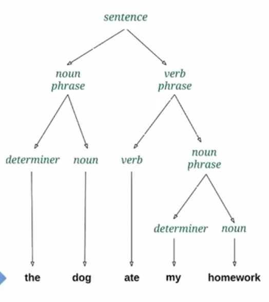
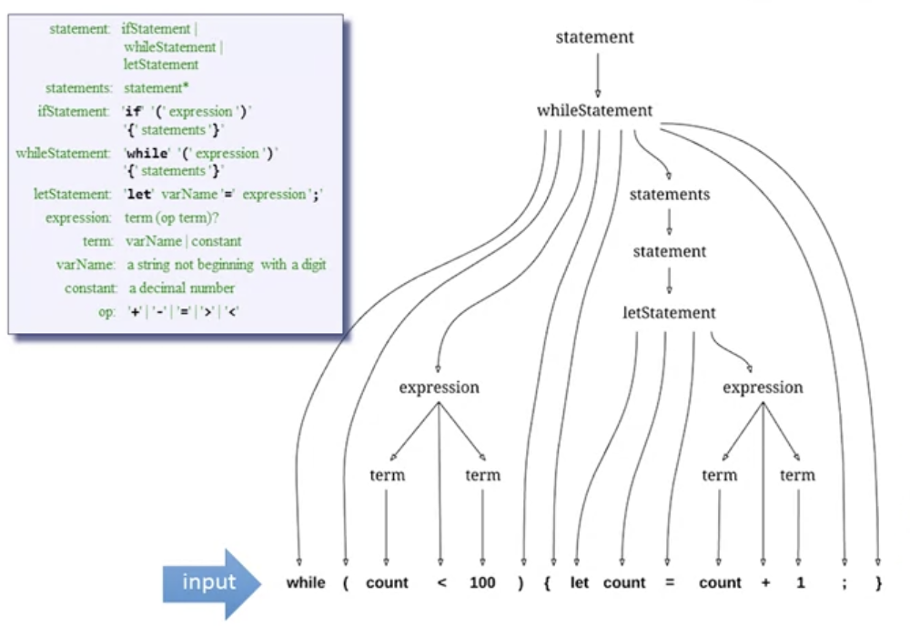
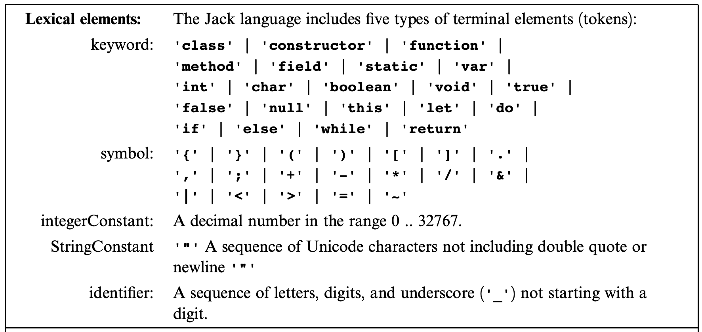
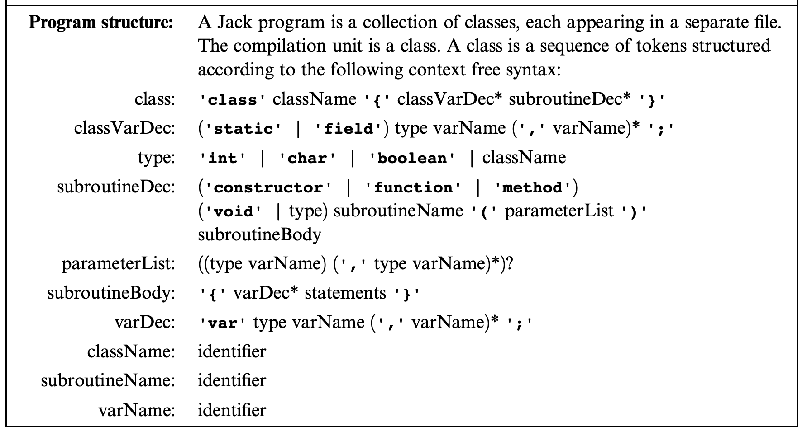
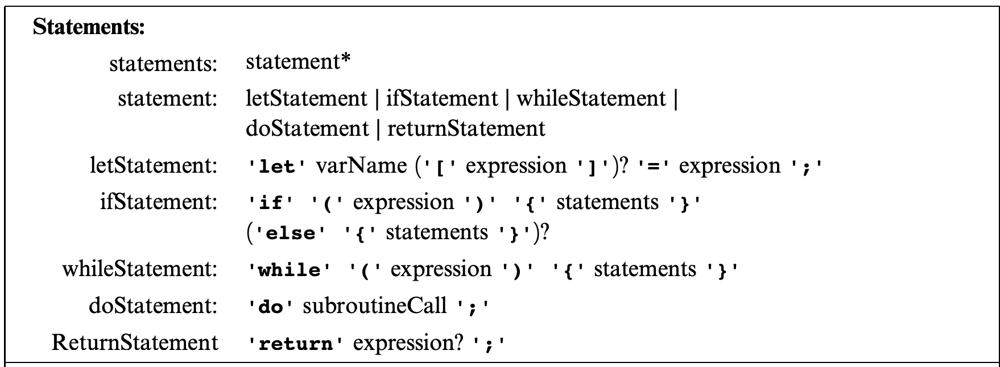
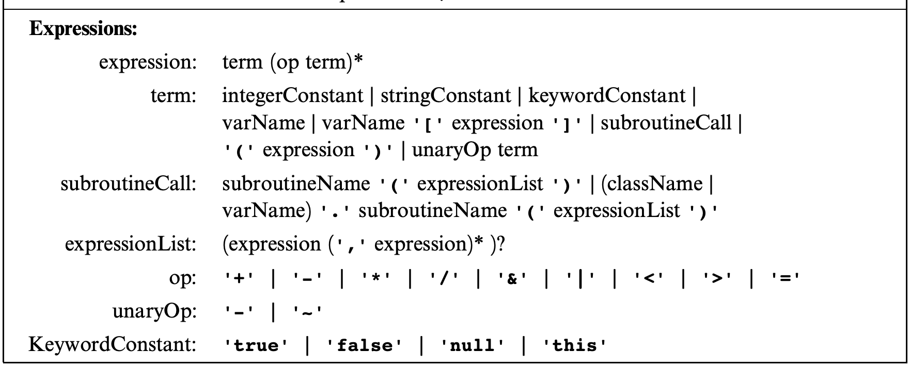
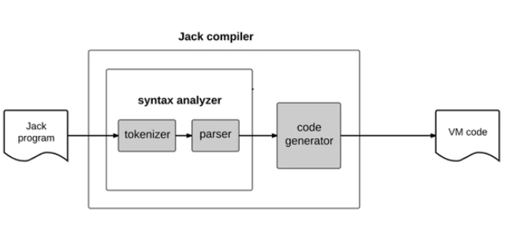

## Syntax Analysis

Once again, we revisit the concept of two-tier compilation. For example, Java programs compile to byte code, while C# programs compile to IL (intermediate language). Jack programs compile to VM code. In this blog post, we focus on the syntax analysis part of building a Jack compiler. Our goal is to create a program that generates an XML file. This XML file will showcase a comprehensive understanding of all the elements of the input Jack code. Let's explore the key aspects we'll be covering:

- Tokenizing
- Grammars
- Parsing
- Parse trees
- XML / mark up
- Compilation
- Handling data

There are two parts that make up our syntax analyzer:

1. Tokenizer
2. Parser

## Lexical Analysis

Consider the following Jack code snippet:

```
if (x < 0) {
  // sign comment
  let sign = "negative"
}
```

The first step is tokenizing. Tokenizing transforms the stream of characters into a stream of meaningful tokens. Here's the tokenized output:

```
if
(
x
)
<
0
{
let
sign
=
"negative"
;
}
```

Each token represents a string of characters with specific meaning. Different programming languages have their own set of tokens. Hence, it is crucial to have a well-defined documentation of the language's tokens. In Jack, we have five categories of tokens:

1. keyword
2. symbol
3. integerConstant
4. stringConstant
5. identifier

For example, given the Jack code snippet:

```
if (x < 153)
{let city = "Paris";}
```

The corresponding tokenized XML markup would be:

```xml
<tokens>
  <keyword> if </keyword>
  <symbol> ( </symbol>
  <identifier> x </identifier>
  <symbol> &lt; </symbol>
  <integerConstant> 153
  </integerConstant>
  <symbol> ) </symbol>
  <symbol> { </symbol>
  <keyword> let </keyword>
  <identifier> city </identifier>
  <symbol> = </symbol>
  <stringConstant> Paris
  </stringConstant>
  <symbol> ; </symbol>
  <symbol> } </symbol>
</tokens>
```

## Grammars

Having a set of valid tokens is not enough to be a valid input. For example, the English sentence "he dog has a" has valid tokens but doesn't make sense. We need grammar rules to describe how to arrange tokens to form meaningful statements in the language. Grammar rules fall into two categories: terminal rules (constants only) and non-terminal rules (all other rules).

Here's a basic example of English grammar:

```
sentence: nounPhrase verbPhrase
nounPhrase: determiner? noun
verbPhrase: verb nounPhrase
noun: 'dog'|'he'
verb: 'has'
determiner : 'a'
```

We'll use a grammar to write a Jack compiler, specifying the tokens and their arrangement. This falls under the domain of computational linguistics.

## Parse Trees

Parsing determines if the given input conforms to the grammar. It constructs a grammatical structure called a parse tree. The parse tree represents the complete morphology or grammatical structure of the input:



Unlike programming languages, parsing natural languages like English can be ambiguous. There could be many interpretations of a natural language parse tree.

> Time flies like an arrow

Possible interpretations:

1. Time passes so quickly, that it flies like an arrow. 
2. There is a certain species of insects, called “time flies”, and those insects happen to like a particular arrow.
3. Use a stop watch to time the flight of flies, just like you time the flight of an arrow.

But, we will focus on the grammar of the Jack programming language. With it, we can construct parse trees too. This parse tree will have an accurate representation of the input Jack program. 



We can use the parse tree to generate XML markup that describes the data's structure in a readable format.

## Parser Logic

To develop the parser for the syntax analyzer, we'll create a class with a set of `compileXXX` methods. `XXX` corresponds to each non-terminal rule in the Jack grammar. We'll follow the right-hand side of each rule and parse the input. If the right-hand side specifies a non-terminal rule, we call the corresponding `compileXXX` method recursively. This assumes the input is already tokenized. The parser relies on the tokenized input.

- Follow right-hand side of rule and parse input
- If the right-hand side specifies a non-terminal rule `XXX`, call `compileXXX`
- Do this recursively

To develop the syntax analyzer, we'll use the grammar of the Jack language as the recipe to write the code of the parser. Note, an LL grammar can be parsed by a recursive descent parser without backtracking. LL(k) parsers need to look ahead at most k tokens to determine which rule is applicable. LL(1) is as soon as you have a particular token in hand, you know which rule to apply.

```
let x = 5 + foo - a       // program 1. Here foo represents a simple variable.
let y = foo[12] - 3      // program 2. Here foo represents an array.
let z = 2 * foo.val()   // program 3. Here foo represents an object.
```

We have to read one more token.  If it’s `[`, we know that we have an array reference. If it’s `.`, we know that we have a method call. Otherwise, it must be a simple variable.  This is the only case in the Jack language in which the parser has to look ahead one more token. Except for this one case, Jack is an LL(1) language. 

## Jack Grammar

Before diving into the grammar, it's essential to understand the notation used:

- '**xxx**' = quoted boldface is used to list language tokens that appears verbatim ("terminals")
- xxx = regular typeface represents names of non terminals
- () = used for grouping
- x | y = indicates that either x or y appears 
- x y = indicates that x appears, and then y appears
- x? = indicates that x appears 0 or 1 times
- x\* = indicates that x appears 0 or more times

The complete Jack grammar is in the book mentioned in the resources section of this blog post. There are four grammar sections: lexical elements, program structure, statements, and expressions. Each section contains rules that define the structure and syntax of Jack programs.

### Lexical elements

There are five categories of terminal elements (tokens)

- keyword
- symbol
- integerConstant
- StringConstant
- identifier



### Program structure

Jack programs are collections of classes. Classes have their own files and compile seperately. They are structured like this in the grammar rules:



### Statements



### Expressions



The handling of expressions is a bit more challenging. It's tricky because of the handling of the term rule. If the current token is a string/integer/keyword constant it's very simple. But, if it's a `varName` there are different possibilities of handling it. The token could be any one of the possibilities below:

```
foo
foo[expression]
foo.bar(expressionList)
Foo.bar(expressionList)
bar(expressionList)
```

To resolve which possibility we're in, the parser will look ahead. It will save the current token, and advance to get to the next one. This is the only case in the Jack grammar where the language becomes LL(2) rather than LL(1).

## The Jack Analyzer



To ensure the syntax analyzer understands the source code, we need to perform unit testing. Our goal is to output a structured syntax (in our case, XML) of the source code, adhering to the Jack grammar. The generated markup represents a textual parse tree and provides a syntactic understanding of the Jack code in a recursive manner.

Here's an example of the Jack analyzer's output for a `returnStatement`:

```xml
<returnStatement>
  <keyword>
    return
  </keyword>
  <expression>
    <term>
      <identifier>x</identifier>
    </term>
  </expression>
  <symbol>;</symbol>
</returnStatement>
```

Also, if we encounter a `nonTerminal` element of type type, class name, subroutine name, variable name, statement, or subroutine call, the parser handles it without marking it up.

```xml
<terminalElement>
xxx
</terminalElement>
```

```xml
<nonTerminal>
 Recursive output for the non-terminal body
</nonTerminal>
```

## Conclusion

You can find my complete implementation of the [Jack analyzer on GitHub](https://github.com/maxdemaio/hack-computer/tree/main/jackAnalyzer). Understanding the syntax analysis step in compilation has been fascinating, especially with its parallels to linguistics. Stay tuned for the next steps in code generation!

## Resources

- Nisan, Noam, and Shimon Schocken. The Elements of Computing Systems: Building a Modern Computer from First Principles. MIT, 2021.