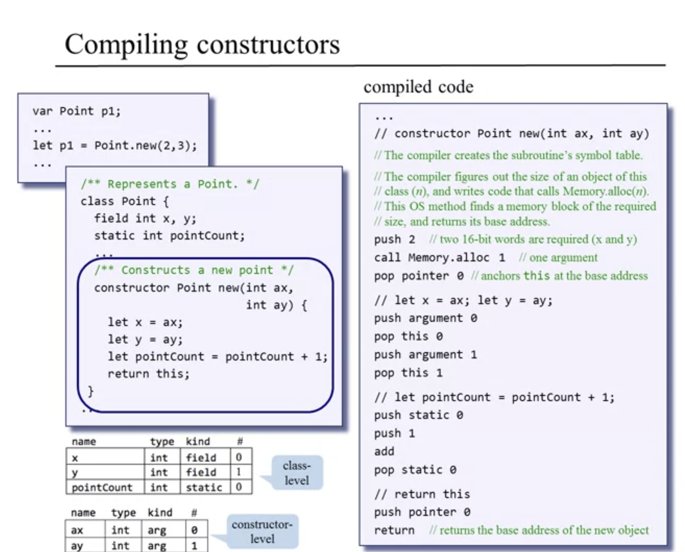

Techniques used:

- Parsing
- Recursive compilation
- Code generation
- Symbol tables
- Memory management

## Code Generation

Here is the roadmap:


Our objective is to build a full scale compiler. We will do this by extending the syntax analyzer and adding code generation abilities.

We will compile one class at a time and deal with:

- class-level code
- sub routine code
  - constructors
  - methods
  - functions

Our challenges will include:

- handling variables
- expressions
- flow of control
- objects
- arrays

That means, expressing the above semantics in VM code.

## Handling Variables

```
sum = x * (1 + rate)
```

The code generator will take this expression and translate it into VM code.

(pseudo VM code)
```
push x
push 1
push rate
+
*
pop sum
```

But, the VM language does not have symbolic variables. It only has things like `local`, `argument`, `this`, `that`, and so on. We need to map the symbolic variables onto these virtual memory segments. We need to know (among other things):

- Whether each variable is a `field`, `static`, `local`, or `argument`
- Whether each variable is the first, second third, or `n`th variable of its kind

(actual VM code, making arbitrary assumptions about the variable kinds)
```
push argument 2
push constant 1
push static 0
add
call Math.multiply 2
pop local 3
```

Variable properties:

- name (identifier)
- type (int, char, boolean, class name)
- kind (field, static, local, argument)
- scope (class level, subroutine level)

This bundle of variable properties must be maintained for every variable. How would we do this? Well, I'm here to tell you that all we need is a symbol table.

### Symbol Tables

```
class Point {
  field int x, y;
  static int pointCount;

  method int distance(Point other) {
    var int dx, dy;
    let dx = x - other.getx();
    let dy = y - other.gety();
    return Math.sqrt((dx*dx)+ (dy*dy));
  }
  // ...
}
```

| name       | type  |  kind    | # |
|------------|:-----:|:---------|--:|
| x          | int   | field    | 0 |
| y          | int   | field    | 1 |

| name       | type  |  kind    | # |
|------------|:-----:|:---------|--:|
| pointCount | int   | static   | 0 |
| this       | Point | argument | 0 |
| other      | Point | argument | 1 |
| dx         | int   | local    | 0 |
| dy         | int   | local    | 1 |


But, there's something special about the `distance` method. We can see three variables, one argument and two local variables. We would stop there if it was a static method! But, it's a class method. Which means, it operates on the current object. So, this object is always represented using the variable `this`. So there would be an implicit argument, `this`.

- Class-level symbol table: can be reset each time we start compiling a new class
- Subroutine-level symbol table: can be reset each time we start compiling a new subroutine

## Handling Expressions

Examples:

- 5
- x
- x + 5
- Math.abs(x+5)
- arr[Math.abs(x+5)]
- foo(arr[Math.abs(x+5)])


prefix notation (functional)

- `* a + b c`

infix notation (human oriented)

- `a * (b + c)`

postfix notation (stack oriented)

- `a b c + *`

The compiler has to translate from infix to postfix. This is because most high-level source languages are infix: Java, Pascal, Python, C#, C, and more. Our target language, VM code, is postfix.

### Two-stage Approach


1. Source code -> parse tree (parser which generates it in XML from our last blog post)
2. Go through each node in a certain order (depth first tree traversal) and generate stack-machine code. This is where you go all the way down a tree, and when you hit a terminal leaf, you process it. Then you backtrack to the closest node and continue that process.

### One-stage Approach

This would involve not creating the entire parse tree as a side effect of code generation. We can generate the VM code on the fly. It will take an expression, and generate code from it. This recursive algorithm will be equipped to take in any infix expression and convert it into VM code.

Note, variables are dictated by the symbol table and how they're mapped to the virtual segments.

```
x + g(2,y,-z) * 5
```

(pseudo code for the compiler)
```
codeWrite(exp):
  if exp is a number n:
    output "push n"

  if exp is a variable var:
    output "push var"

  if exp is "exp1 op exp2":
    codeWrite(exp1),
    codeWrite(exp2),
    output "op"

  if exp is "op exp":
    codeWrite(exp),
    output "op"

  if exp is "f(exp1, exp2, ...)":
    codeWrite(exp1),
    codeWrite(exp2), ...,
    output "call f"
```

(output VM code)
```
push x
push 2
push y
push z
-
call g
push 5
*
+
```

### From parsing to code generation

In the previous blog post we wrote a tokenizer and parser.

(Source Hack code)
```
let length = Keyboard.readInt("HOW MANY NUMBERS? ");
```


Parsed code according to grammar:
```xml
<letStatement>
  <keyword> let </keyword>
  <identifier> length </identifier>
  <symbol> = </symbol>
  <expression>
    <term>
      <identifier> Keyboard </identifier>
      <symbol> . </symbol>
      <identifier> readInt </identifier>
      <symbol> ( </symbol>
      <expressionList>
        <expression>
          <term>
            <stringConstant> HOW MANY NUMBERS?  </stringConstant>
          </term>
        </expression>
      </expressionList>
      <symbol> ) </symbol>
    </term>
  </expression>
  <symbol> ; </symbol>
</letStatement>
```
Now, we need to turn this into stack based VM code. Going forward, we have no use for that XML parsed output. We need to replace that with a program that takes these pieces of grammar and translates them into its stack based VM code equivalent.

## Handling Flow of Control

Our VM language has knowledge of `goto` `if-goto` and `label`. The challenge we face is that we're going to have to translate or re-express the semantics of high level Jack code to the VM language.

High level code (binary search for calculating the square root of x):

```
let low = 0;
let high = x;
while ((high - low) > epsilon) {
  let mid = (high + low) / 2;
  if ((mid * mid) > x) {
    high = mid;
  }
  else {
    let low = mid;
  }
}
```

```
statement
...
while (expression) {
  statement
  ...
  if (expression) {
    statement
    ...
  }
  else {
    statement
    ...
  }
}
statement
...
```

### Compiling if statements


Source code:
```
if (expression)
  statements1
else
  statements2
...
```

Surprisingly, if we negate our expression, it becomes much easier to write in VM language. If the negation is true, we go to statement 2, if the negation is false we go to statement1 (because without the negation it'd be `true`).

VM code:
```
compiled (expression)
not
if goto L1
compiled (statements1)
goto L2
label L1
  compiled (statements2)
label L2
  ...
```

### Compiling while statements


Source code:
```
while (expression)
  statements
```

VM code:

```
label L1
  compiled (expression)
  not
  if goto L2
  compiled (statements)
  goto L1
label L2
  ...
```

### Minor compilications

A program can contain many `if` and `while` statements. Our solution to this is that the generated labels by the compiler will be unique. 

Also, `if` and `while` statements can be nested. The level of nesting is theoretically infinite. This is also handeled by our compiler's recursive strategy!

## Handling Objects: Low-level Aspects

- High-level OO programs create and manipulate objects and arrays
- Mid-level VM programs operate on virtual memory segments
- Low-level machine programs operate directly on RAM

We're bridging the gap with our compiler from high-level to mid-level programs.

### Memory segments

The VM implementation deals with mapping onto the host RAM by looking at the RAM in a very specific way. We have virtual memory segments that get mapped onto it like the following image:


The first 5 words in the RAM are used as very important pointers that hold the current values of the stack pointer, the base address of the local segment, argument segment, and so on. All these segments belong to the current VM function that is currently running.

The VM implementation also allocates RAM for the global stack. This keeps the working stack of the currently running function as well as the working stacks and memory segments of functions that are waiting for the current function to terminate (functions on the calling chain).

### Applying handling object and array data

So, how do we use this architecture to represent objects' and arrays' data? It's similar but slightly different.

Firstly, we use a different area on the RAM altogether call the heap. 


On the heap we record all the data of objects and arrays of the current program seeks to manipulate. These are managed using the `this` and `that` segments using `pointer`. But, we need to tell the system to which object we are referring.

- Object data is accessed via the `this` segment
- Array data is accessed via the `that` segment
- Before using these segments, we must first anchor them using `pointer`

## Handling Objects: Construction

```
...
var Point p1;
...
let p1 = Point.new(2,3);
...
```

```
class Point {
  ...
  constructor Point new(...)
  ...
}
```

When we define the variable `p1`, it will map it on some location on the stack where its value is initialized to 0. Then, when we call the constructor, that 0 on the stack will be changed to point to the base address of the object proper on the heap.


- During compile time, the compiler maps `p1` on `local 0`, `p2` on `local 1`, and `d` on `local 2`.

- During run-time, the execution of the constructor's code effects the creation of the objects themselves, on the heap.

### Compiling constructors

A constructor typically does two things: 

- Arranges the creation of a new object
- Initializes the new object to some initial state

How to access the object's fields:

- The constructor's code can access the object's data using the `this` segment
- But first, the constructor's code must anchor the `this` segment on the object's data, using `pointer`



## Handling Objects: Manipulation

### Compiling method

Ultimately, the target machine language is procedural. So, the compiler needs to rewrite the OO method calls in a procedural style. The object is always treated as the first, implicit argument.

OO:
```
p1.distance(p2)
p1.getx()
obj.foo(x1, x2, ...)
```

Procedural:
```
distance(p1, p2)
getx(p1)
foo(obj, x1, x2, ...)
```


After, the pseudo code for the compiled caller would look something like:

```
push p1
push p2
call Point.distance
push d
```

### Compiling void methods


## Handling Arrays

### Array construction

```
var Array arr;
...
let arr = Array.new(5);
```

After reading `var Array arr` there will be no code generated. This only effects the symbol table. Then, after constructing the array with `let arr = Array.new(5)`, from the caller's perspective it's handled exactly like object construction.

### Reminder

`this` and `that` are two "portable" virtual memory segments that can be aligned to different RAM addresses. For our use, `this` will represent the values of the current object. Then `that` represents the values of the current array.

- pointer (base address) for `this`: `THIS` (address 3 in RAM)
- pointer (base address) for `that`: `THAT` (address 4 in RAM)
- How to set `this`: `pop pointer 0` (sets `THIS`)
- How to set `that`: `pop pointer 1` (sets `THAT`)

Note, `pointer` is another virtual memory segment which only has two entries. The first represents `THIS` and the second entry represents `THAT`.

### Array access

```
// arr[2] = 17
push arr // base address
push 2 // offset
add
pop pointer 1 // store address in THAT pointer
pop that 0
```

```
// arr[expression1] = expression2
// a[i] = b[j]
push a
push i
add
push b
push j
add         // state 1
pop pointer 1
pop temp 0  // state 2
pop pointer 1
push temp 0 // state 3
pop that 0
```

## Standard Mapping Over the Virtual Machine

### Files and subroutines mapping

- Each file `filename.jack` is compiled into the file `filename.vm`
- Each subroutine `subname` in `filename.jack` is compiled into a VM function `filename.subname`
- A Jack `constructor`/`function` with `k` arguments is compiled into a VM function that operates on `k` arguments
- A Jack `method` with `k` arguments is compiled into a VM function that operates on `k+1` arguments

### Variables mapping

- local variables are mapped on the virtual segment `local`
- argument variabels are mapped on the virtual segment `argument`
- static variables of a `.jack` class file are mapped on the virtual memory segment `static` of the compiled `.vm` class file
- field variables of the current object are accessed as follows:
  - assumption: `pointer 0` has been set to the `this` object
  - the i-th field of this object is mapped onto `this i`

### Arrays mapping

- accessing an array entry `arr[i]`:
  - set `pointer 1` to the entry's address (`arr + i`)
  - access the entry by accessing `that 0`

### Compiling subroutines

- for methods, the compiled VM code must set the base of the `this` segment to `argument 0`
- for constructors, the compiled VM code must allocate a memory block for the new object, and then set the base of the segment `this` to the new object's base address
- for constructors, the compiled VM code must return the object's base address to the caller
- for void functions/methods, the compiled VM code must return the value `constant 0`.

### Compiling subroutine calls

- `subName(arg1, arg2, ...)`, the caller (a VM function) must push the arguments onto the stack, and then call the subroutine
- If the called subroutine is a `method`, the caller must first push a reference to the object on which the method is supposed to operate
  - next the caller must push `arg1`, `arg2`, ... and then call the method
- a void subroutine does not return a value at the Jack level. But, at the VM level it must return some dummy value. Therefore, when compiling the Jack statement `do subName`, following the call the caller must pop (and ignore) the returned value.

### Compiling constants

- `null` is mapped on the constant `0`
- `false` is mapped on the constant `0`
- `true` is mapped on the constant `-1`

### OS classes and subroutines

The basic Jack OS is implemented as a set of compiled VM class files. All the OS class files must reside in the same directory as the VM files generated by the compiler. Any VM function can call any OS VM function for its effect.

### Special OS services

- Multiplication
- Division
- String constants
- String assignments
- Object construction
- Object recycling
