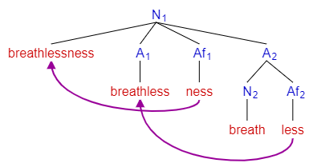

The study of words, how they are constructed, and their relationship to other words in the same language.

---

What even is a word? Well, for each word we'd expect to find its entry in a dictionary. Meanings of words can be unpredictable and each word is known as a lexeme or lexical item since their key/value pairs are in a lexicon (dictionary). The words we use are arbitrary [signs](<https://en.wikipedia.org/wiki/Sign_(semiotics)>) that are essentially [pointers](<https://en.wikipedia.org/wiki/Pointer_(computer_programming)>) to objects/ideas in the world.

Now, let's take the words `cat` and `cats`. These words are quite similar and are only different by the plurality [morpheme](https://en.wikipedia.org/wiki/Morpheme) `-s`, only found bound to noun phrases. Meanwhile `cat` is already in its smallest most unpredictable form that conveys meaning; so `cat` is a morpheme. The study of morphemes is known as morphology.

**Really cool observation**: It's helpful to divide words into morphemes because it lets us see patterns across languages. One word in one language might be a part of a word in another. For example, the sentence `she is my friend` in English versus the sentence `elle est mon amie` in French. You can see that French adds a feminine suffix morpheme since French nouns have gender. Also, sometimes in other languages a sentence could be reduced to several words based on the language's morphology. Looking at morphemes allows one to enjoy and observe the differences and similarities across languages.

- Free morpheme: morpheme can stand by itself and can appear within lexemes
- Compound morpheme: two or more free morphemes together
- Bound morpheme: morpheme can't stand by itself
- Root: stand-alone base morpheme
  - note: not all roots are free morphemes: `conceive`, `receive`, `deceive`. However, all free morphemes are roots.
- Affix: morpheme that is attached to a word stem to form a new word or word form
  - note: [not all bound morphemes are affixes](https://en.wikipedia.org/wiki/Cranberry_morpheme), but all affixes are bound morphemes.
  - note: there are [many categories of affixes](https://en.wikipedia.org/wiki/Affix).

Fusional morphology comes into play when a single inflectional morpheme denotes multiple grammatical, syntactic, or semantic features. Take my example from before in French, `elle est mon amie`. If you just look at the word `amie` you can tell it's both singular and feminine by the feminine suffix morpheme `e`. English and French are both [fusional languages](https://en.wikipedia.org/wiki/Fusional_language). However, not all languages are like this. By contrast, Classical Chinese has very little morphology, using almost exclusively free morphemes and depending on word order to convey meaning. By analyzing the [linguistic topology](https://en.wikipedia.org/wiki/Linguistic_typology) of languages we can further classify them.

We can represent morphological structure graphically in the form of tree diagrams. Each node in the tree diagram would represent a morpheme. This also means that morphological structure is [recursive](https://en.wikipedia.org/wiki/Recursion).

Abbreviations and conventions:

- N = noun
- A = adjective
- V = verb
- P = preposition
- Adv = adverb
- Af = affix

Let's look at the tree diagram for the word `breathlessness`. If you'd like to mess around creating your own, check out [this GitHub repository](https://github.com/maxdemaio/jssyntaxtree).

The derivational steps assumed are:

1. `[Noun breath] + [Suffix less] = [Adjective breathless]`

2. `[Adjective breathless] + [Suffix ness] = [Noun breathlessness]`

Words are difficult to explain. There are so many edge cases about the word "word" that explaining things in terms of morphemes allows us to be more precise. The study of morphemes is morphology, researching what words really mean.

## Works Cited

- CrashCourse. “Morphology: Crash Course Linguistics #2” _YouTube_, 18 Sept. 2020, [https://youtu.be/93sK4jTGrss](https://youtu.be/93sK4jTGrss).

- “Morphology.” _Wikipedia_, 12 June 2021, [https://en.wikipedia.org/wiki/Morphology](https://en.wikipedia.org/wiki/Morphology). Accessed 4 July 2021.
